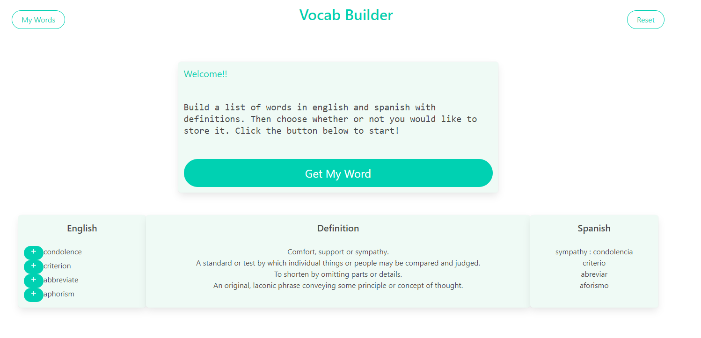

# vocabBuilder

## A quick look!
An application to introduce  new vocabulary terms to use in everyday life
Generates a random vocab word from a list of 900+ words
Gives word/definition
Gives spanish translation as well(for bilingual users)
Learn new words in Spanish and add them to your word bank!

Website:  https://lonxyboi22.github.io/vocabBuilder/

# User Story:

AS A person interested in words and trying to expand my vocabulary

I WANT a website that I press a button I generate a random english word, its spanish translation, and definition

SO THAT I can learn new words in both English and Spanish

AS A person trying to expand my vocabulary

I WANT a website that allows me to save my vocab words to storage

SO THAT  I can review the words in the future

Technologies used
# Breakdown of tasks and roles:
## Angela - Design (Bulma), API 2 key function, Spanish function, MyWords function list.
## Paige- Local Storage, Spanish Function, MyWords function.
## Andrew- API 1 key function, Definition Function, Display english word function
## Rich-Spanish Word Function, RandomWord function
# Challenges
Working in a group with different schedules
Syncing branches
# Successes
## MVP

# Example

## Curated by Angela Gola, Andrew Macpherson, Rich, and Paige Caiozzo.

